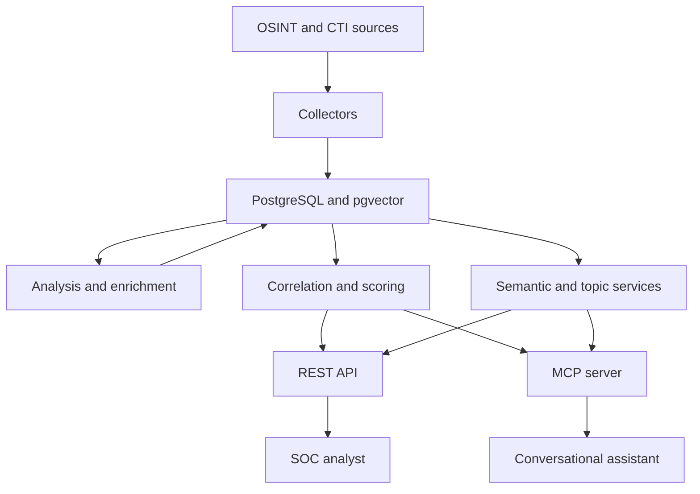

# ThreatIntelMCP

ThreatIntelMCP is a Threat Intelligence platform developed in Python as a Final Year Project (PFE). It collects intelligence from OSINT and CTI sources, analyzes and enriches it, correlates indicators, calculates explainable threat scores, stores structured intelligence in PostgreSQL, and exposes the results through REST and the Model Context Protocol (MCP).

The platform is designed for SOC investigation workflows. It combines deterministic internal services with external intelligence providers while preserving traceable evidence, confidence information, warnings, and operational state.

## Project status

**Status:** Active development
**Current milestone:** Day 9A — emerging-threat topic detection completed
**Next milestone:** Day 9B — analyst-facing frontend
**End-to-end backend:** Operational

The current backend pipeline is:

```text
RSS, GitHub and MITRE collection
→ PostgreSQL storage
→ Claude article analysis
→ IOC normalization and CVE/OTX enrichment
→ multi-source correlation
→ threat and confidence scoring
→ semantic indexing and emerging-topic detection
→ REST and MCP interfaces
→ SOC analyst or conversational assistant
```

### Implemented capabilities

- [x] RSS collection from The Hacker News, BleepingComputer and Cisco Talos
- [x] PostgreSQL storage through SQLAlchemy Core
- [x] Claude-based article analysis with validation and controlled fallback
- [x] IOC, CVE, malware, MITRE technique, APT group, sector and technology extraction
- [x] Strict IOC normalization and type validation
- [x] NVD CVE lookup, normalization, caching and stale-cache fallback
- [x] AlienVault OTX indicator lookup, caching and stale-cache fallback
- [x] GitHub Security Advisory collection and retrieval
- [x] MITRE ATT&CK synchronization for Enterprise, Mobile and ICS
- [x] Article-to-IOC relationships and indicator correlation
- [x] Article and indicator investigations
- [x] Explainable threat, confidence and priority scoring
- [x] Structured scoring warnings shared by REST and MCP
- [x] Semantic article search with pgvector
- [x] Automatic embedding creation and refresh
- [x] Emerging-threat topic detection with DBSCAN and TF-IDF
- [x] Relative-share trend detection for rising, stable and declining topics
- [x] Read-only REST API with validated Pydantic contracts
- [x] MCP read tools and controlled action tools
- [x] Pipeline status reporting and controlled automation cycles
- [x] Deterministic unit, contract, regression and PostgreSQL integration tests
- [x] Isolated PostgreSQL integration database
- [x] Controlled live smoke tests separated from pytest
- [x] French technical documentation for completed backend modules

### Remaining work

- [ ] Analyst-facing frontend and visualizations — Day 9B
- [ ] Final end-to-end acceptance review — Day 10
- [ ] Consolidated user manual and demonstration guide
- [ ] Final PFE report alignment and presentation material
- [ ] Production deployment, authentication, monitoring and scheduling

## Architecture



The architecture separates:

1. collection from external sources;
2. durable storage and caching;
3. AI analysis and deterministic validation;
4. enrichment, correlation and scoring;
5. semantic retrieval and topic detection;
6. REST and MCP delivery;
7. controlled automation and operational status.

Unstable external boundaries can be mocked while tests continue to exercise the real internal services and PostgreSQL repositories.

## Intelligence sources

| Source | Purpose | Integration status |
|---|---|---|
| The Hacker News | RSS cybersecurity articles | Operational |
| BleepingComputer | RSS cybersecurity articles | Operational |
| Cisco Talos | Threat research articles | Operational |
| NVD | CVE details and CVSS enrichment | Operational |
| GitHub Security Advisories | Package and vulnerability advisories | Operational |
| MITRE ATT&CK | Enterprise, Mobile and ICS techniques | Operational |
| AlienVault OTX | Indicator reputation and pulse intelligence | Operational |

## Core capabilities

### Collection and analysis

RSS articles are normalized and inserted idempotently using their links. Pending articles are analyzed by Claude with a strict JSON contract. The analyzer validates required fields, classification values, severity, confidence, CVE identifiers and MITRE technique identifiers before allowing the pipeline to continue.

An analysis failure leaves the article unprocessed. A later retry can succeed without duplicating the article or its dependent intelligence.

### Enrichment and caching

CVE intelligence is obtained from NVD and indicator intelligence from AlienVault OTX. Both integrations normalize external responses before storage and use local cache freshness rules.

When a provider is unavailable, a valid stale-cache fallback can preserve existing intelligence while returning explicit warnings. Automated tests mock these external boundaries and never require live Internet access.

### Correlation and investigation

Normalized indicators are linked to their originating articles. The correlation service combines local article evidence with OTX intelligence and exposes deterministic investigation results.

Article investigations aggregate:

- analysis and severity;
- CVEs and enrichment;
- normalized indicators;
- indicator reputation;
- malware and ATT&CK context;
- warnings produced by unavailable optional enrichment.

### Scoring and prioritization

ThreatIntelMCP calculates separate threat and confidence assessments before producing a priority and recommended action. The scoring logic is transparent and deterministic.

Important outputs include:

- threat score;
- confidence score;
- priority level;
- contributing factors;
- structured warnings with `source` and `message`.

REST and MCP expose the same scoring values and warnings.

### Semantic search

Semantic Search V1 is implemented for threat articles using:

- `intfloat/multilingual-e5-small`;
- Sentence Transformers;
- 384-dimensional normalized embeddings;
- PostgreSQL with pgvector;
- cosine similarity;
- SHA-256 content hashes for change detection.

Article embeddings are created in advance. During a search, only the query is embedded, then PostgreSQL compares it with stored vectors.

The indexed passage prioritizes content in this order:

```text
AI summary → RSS summary → title
```

Natural-language queries are supported in English and French. The embedding worker runs in an isolated subprocess so a timeout can terminate the worker without leaving a zombie process or corrupting MCP stdio communication.

### Emerging-threat topics

Day 9A detects recurring semantic themes from existing article embeddings without loading the embedding model or calling an external service.

The implementation uses:

- a configurable observation window, defaulting to 30 days;
- a recent comparison window, defaulting to 7 days;
- DBSCAN with cosine distance;
- calibrated `eps=0.105` and a minimum cluster size of 3;
- TF-IDF labels and keywords;
- relative recent and previous article shares;
- representative articles selected by centroid similarity;
- aggregated CVE, malware, MITRE, APT, sector and technology evidence.

Articles not belonging to a sufficiently dense group remain noise rather than being presented as false trends. Topics are classified as `rising`, `stable` or `declining`.

The feature is available through:

- `GET /api/v1/topics/emerging`;
- MCP tool `get_emerging_threat_topics`.

## REST API

The FastAPI application provides versioned, validated read endpoints.

| Domain | Endpoint | Purpose |
|---|---|---|
| Health | `GET /health` | API availability |
| Pipeline | `GET /api/v1/pipeline/status` | Operational pipeline state |
| Articles | `GET /api/v1/articles` | Search analyzed articles |
| Articles | `GET /api/v1/articles/{article_id}` | Article details |
| Articles | `GET /api/v1/articles/{article_id}/investigation` | Full article investigation |
| Articles | `GET /api/v1/articles/{article_id}/score` | Article scoring |
| Search | `GET /api/v1/search/articles/semantic` | Semantic article search |
| Topics | `GET /api/v1/topics/emerging` | Emerging-threat topics |
| CVEs | `GET /api/v1/cves` | Search cached CVEs |
| CVEs | `GET /api/v1/cves/{cve_id}` | CVE details |
| Indicators | `GET /api/v1/indicators/correlation` | Indicator correlation |
| Indicators | `GET /api/v1/indicators/score` | Indicator scoring |
| MITRE | `GET /api/v1/mitre/techniques` | Search ATT&CK techniques |
| MITRE | `GET /api/v1/mitre/techniques/{technique_id}` | Technique details |
| GitHub | `GET /api/v1/github/advisories` | Search advisories |
| GitHub | `GET /api/v1/github/advisories/{ghsa_id}` | Advisory details |

Interactive OpenAPI documentation is available at `/docs` while the REST server is running.

## MCP tools

The MCP server exposes read-only investigation tools and controlled action tools.

### General and articles

- `ping`
- `search_threat_articles`
- `semantic_search_threat_articles`
- `get_threat_article_details`
- `investigate_threat_article`
- `score_threat_article`
- `get_emerging_threat_topics`

### CVE, indicators and extracted entities

- `search_cves`
- `get_cve_details`
- `lookup_otx_indicator`
- `correlate_threat_indicator`
- `score_threat_indicator`
- `search_malware`
- `search_mitre`
- `search_apt_groups`
- `search_targeted_sectors`
- `search_affected_technologies`

### GitHub and MITRE intelligence

- `search_github_advisories`
- `get_github_advisory_details`
- `search_mitre_techniques`
- `get_mitre_technique_details`

### Pipeline status and controlled actions

- `get_pipeline_status`
- `ingest_rss_articles`
- `process_pending_articles`
- `index_pending_embeddings`
- `synchronize_mitre_intelligence`
- `synchronize_github_intelligence`

Mutating tools use explicit confirmation controls. Investigation and search tools remain read-only.

## Project structure

```text
ThreatIntelMCP/
├── ai/                    # Claude analysis and validation
├── api/                   # FastAPI application, routers and schemas
├── collectors/            # RSS, GitHub, MITRE and OTX collectors
├── correlation/           # Article and indicator investigations
├── database/              # SQLAlchemy Core repositories and schema
│   └── migrations/        # Versioned database migrations
├── docs/                  # French technical documentation
├── enrichment/            # CVE, IOC and OTX enrichment
├── mcp_server/            # MCP server and client
├── pipeline/              # Ingestion, processing and automation services
├── scoring/               # Threat, confidence and priority scoring
├── scripts/               # Automation, backfill and maintenance commands
├── semantic_search/       # Embedding and semantic-search services
├── topic_modeling/        # Emerging-topic detection
├── tests/                 # Unit, contract and integration tests
├── main.py                # Automation-cycle CLI entry point
├── requirements.txt
└── README.md
```

## Technology stack

- Python 3.10
- PostgreSQL and pgvector
- SQLAlchemy Core
- FastAPI and Pydantic
- MCP Python SDK
- Anthropic Claude
- Sentence Transformers
- scikit-learn
- NumPy
- NVD API
- GitHub Security Advisories
- MITRE ATT&CK STIX data
- AlienVault OTX
- pytest and pytest-cov
- Git and GitHub

## Installation

### 1. Clone the repository

```bash
git clone https://github.com/feres2005/ThreatIntelMCP.git
cd ThreatIntelMCP
```

### 2. Create and activate a virtual environment

```powershell
python -m venv venv
venv\Scripts\Activate.ps1
```

### 3. Install dependencies

```powershell
python -m pip install -r requirements.txt
```

The embedding model is downloaded automatically on first use. Topic detection reuses stored embeddings and does not download or load the model.

### 4. Configure PostgreSQL

Install PostgreSQL and enable the pgvector extension. Create the development database, then apply the SQL migrations in `database/migrations` in numerical order or restore the current schema from `database/schema.sql`.

The default development database used by the project is:

```text
threat_intel_db
```

### 5. Configure environment variables

Create `.env` from the provided example and configure the values required by the operations you intend to run.

Typical variables include:

```text
DATABASE_URL
ANTHROPIC_API_KEY
OTX_API_KEY
GITHUB_TOKEN
```

Never commit `.env` or API credentials.

## Running the platform

### Controlled automation cycle

```powershell
python -m main
```

### REST API

```powershell
python -m uvicorn api.app:app --reload
```

Then open:

```text
http://127.0.0.1:8000/docs
```

### MCP server

```powershell
python -m mcp_server.server
```

### Backfill article embeddings

```powershell
python -m scripts.backfill_article_embeddings
```

## Testing

The default pytest run is deterministic and does not require live Internet services. Claude, RSS, NVD, OTX, GitHub, MITRE and the embedding model are mocked at unstable external boundaries.

The validated Day 9A test status is:

- 943 tests pass in the default deterministic suite;
- 10 PostgreSQL integration tests are skipped by default and pass separately;
- 953 automated tests are available in total;
- branch coverage is 82.0%;
- the configured 80% coverage gate passes.

### Fast test suite

```powershell
python -m pytest -q
```

PostgreSQL integration tests are skipped unless explicitly enabled.

### Isolated PostgreSQL integration suite

Integration tests use only:

```text
threat_intel_test_db
```

Run them explicitly:

```powershell
$env:RUN_POSTGRES_INTEGRATION='1'
try {
    python -m pytest -q -m integration tests\integration
}
finally {
    Remove-Item Env:RUN_POSTGRES_INTEGRATION -ErrorAction SilentlyContinue
    Remove-Item Env:DATABASE_URL -ErrorAction SilentlyContinue
}
```

The fixture verifies `current_database()` before every cleanup and refuses to truncate any database other than `threat_intel_test_db`.

### Coverage gate

```powershell
python -m pytest --cov=. --cov-branch --cov-fail-under=80
```

The project enforces a minimum total coverage of 80%.

### Controlled live smoke tests

Live provider checks are executed manually and separately from normal pytest. They are intended to confirm external contract compatibility without making automated tests depend on provider availability, quotas or network conditions.

## Reliability and safety guarantees

Automated coverage includes the following behaviors:

- mandatory failure never produces false success;
- analysis failure leaves an article unprocessed;
- optional enrichment failure produces warnings;
- successful processing marks the article as processed;
- retry after failure can succeed;
- retries do not duplicate articles, IOCs, analyses or embeddings;
- semantic worker timeouts terminate the worker process;
- SQLAlchemy validates pooled connections before reuse;
- PostgreSQL integration tests cannot clean the development database;
- REST and MCP preserve important scoring and topic values.

## Documentation

French technical documentation is maintained in `docs/` and finalized after implementation, testing and review of each milestone.

Relevant documents include:

- semantic search and embedding maintenance;
- automated processing, correlation and scoring;
- REST and MCP interfaces;
- end-to-end validation and resilience;
- emerging-threat topic detection.

The README will be revised again after Day 9B to include the frontend, screenshots and analyst workflow.

## Current limitations

- The analyst-facing frontend is not yet implemented.
- Semantic Search V1 indexes articles only.
- Emerging-topic detection requires dated articles with existing embeddings.
- Topic clustering uses fixed calibrated DBSCAN parameters and a maximum of 500 candidate articles.
- Topic results are calculated on demand and are not yet stored as historical snapshots.
- Production scheduling still requires an external scheduler or deployment platform.
- Production authentication, authorization, rate limiting and monitoring are not yet configured.
- Availability of live collection and enrichment operations depends on third-party providers.
- The platform has not yet completed its final Day 10 acceptance review.

## Roadmap

### Day 9A — completed

- complete emerging-topic detection;
- validate PostgreSQL storage behavior;
- verify REST/MCP consistency;
- finalize tests and French documentation.

### Day 9B — next

- build the analyst-facing frontend;
- connect it to the REST API;
- present investigations, scoring, semantic search and emerging topics;
- add screenshots and frontend usage instructions.

### Day 10 — finalization

- execute final end-to-end acceptance tests;
- review security, dependencies and Git state;
- consolidate the user manual and API documentation;
- align the repository with the PFE specification;
- prepare the final demonstration and delivery material.

Possible post-PFE extensions include CISA KEV, URLhaus, MISP, VirusTotal, historical topic tracking, alerting, hybrid search and production monitoring.

## Development methodology

Each module follows the same process:

1. understand the theory and PFE requirement;
2. design responsibilities and boundaries;
3. implement incrementally;
4. test deterministic behavior and failures;
5. run integration validation where necessary;
6. refactor and review;
7. document the module in French;
8. validate the complete suite;
9. commit and push the milestone.

## Security

- Secrets and API keys are stored in environment variables.
- `.env` files are excluded from Git.
- SQL uses parameterized SQLAlchemy Core statements.
- REST schemas and MCP tools validate public inputs.
- External provider responses are normalized before storage.
- Mutating MCP actions require explicit confirmation.
- Automated integration tests use an isolated PostgreSQL database.
- Internal errors are converted to controlled public responses.

## License

No license has currently been specified for this project.
