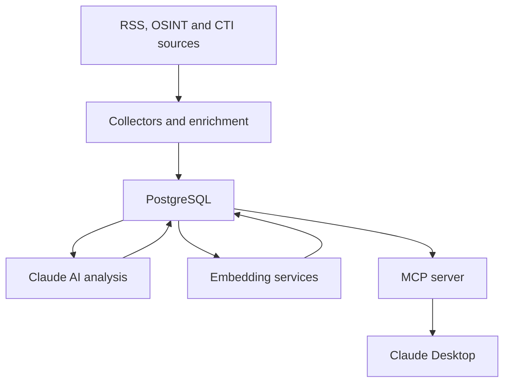

# ThreatIntelMCP

ThreatIntelMCP is an intelligent Threat Intelligence platform developed in Python as a Final Year Engineering Project (PFE).

The platform collects cybersecurity intelligence from OSINT and CTI sources, analyzes and enriches it using artificial intelligence and external intelligence providers, stores the resulting intelligence in PostgreSQL, and exposes it through the Model Context Protocol (MCP) to conversational assistants such as Claude Desktop.

## Project Status

**Status:** Active development
**Current milestone:** PFE Version 1
**Estimated overall PFE completion:** approximately 68%
**Functional end-to-end prototype:** operational

The following pipeline is currently functional:

```text
Collection
→ PostgreSQL
→ AI analysis
→ IoC and CVE extraction
→ threat enrichment
→ semantic retrieval
→ MCP response
→ Claude Desktop
```

### Completed

* [x] RSS collection from cybersecurity sources
* [x] PostgreSQL database with SQLAlchemy Core
* [x] AI-powered article analysis with Claude
* [x] IoC, CVE, malware, APT and MITRE ATT&CK extraction
* [x] NVD CVE enrichment
* [x] GitHub Security Advisories integration
* [x] MITRE ATT&CK integration
* [x] AlienVault OTX integration
* [x] Local OTX cache with automatic 24-hour refresh
* [x] MCP server and Threat Intelligence tools
* [x] Claude Desktop integration
* [x] Semantic article search with pgvector
* [x] Multilingual semantic queries in English and French
* [x] Automatic article embedding maintenance
* [x] French technical documentation for completed modules
* [x] Database migrations and schema export

### Partially Completed

* [~] Automatic intelligence freshness

  * OTX indicators are refreshed automatically.
  * Unknown or stale CVEs are not yet fetched automatically during exact lookup.
* [~] Automatic threat correlation

  * AI analysis extracts CVEs, MITRE techniques, APT groups, targeted sectors and affected technologies.
  * A dedicated multi-source correlation engine is still required.
* [~] Conversational SOC assistant

  * Claude Desktop can select and call investigation tools automatically.
  * Collection and analysis actions are not yet exposed as MCP actions.
* [~] Testing

  * Features have been validated incrementally and end-to-end.
  * A consolidated automated test suite is still required.

### Remaining Mandatory PFE Capabilities

* [ ] On-demand CVE enrichment and freshness management
* [ ] Threat scoring and prioritization
* [ ] Topic modelling and emerging-threat detection
* [ ] Advanced automatic correlation
* [ ] REST API
* [ ] Additional MCP actions where justified
* [ ] Automated regression and integration tests
* [ ] User manual
* [ ] Consolidated API documentation
* [ ] Final PFE report and demonstration material

## Current Data Sources

| Source                     | Purpose                               | Status      |
| -------------------------- | ------------------------------------- | ----------- |
| The Hacker News            | RSS threat articles                   | Operational |
| BleepingComputer           | RSS threat articles                   | Operational |
| Cisco Talos                | Threat research articles              | Operational |
| NVD                        | CVE enrichment                        | Operational |
| GitHub Security Advisories | Vulnerability and package advisories  | Operational |
| MITRE ATT&CK               | Enterprise, Mobile and ICS techniques | Operational |
| AlienVault OTX             | Indicator enrichment and reputation   | Operational |

## Main Features

* Collection of cybersecurity articles from RSS feeds
* AI-generated threat summaries
* Threat classification and severity assessment
* Confidence scoring for AI analysis
* Extraction of:

  * indicators of compromise;
  * CVE identifiers;
  * malware families;
  * MITRE ATT&CK techniques;
  * APT groups;
  * targeted sectors;
  * affected technologies
* CVE enrichment through NVD
* GitHub Security Advisory storage and retrieval
* MITRE ATT&CK technique synchronization
* AlienVault OTX indicator lookup and caching
* Semantic article search using natural-language queries
* PostgreSQL vector storage with pgvector
* MCP tools for conversational Threat Intelligence investigation
* Claude Desktop integration

## Architecture



The ingestion and investigation architecture follows these stages:

1. Collect raw intelligence from RSS, OSINT and CTI sources.
2. Store normalized records in PostgreSQL.
3. Analyze articles with Claude.
4. Extract and enrich threat entities.
5. Generate and store semantic embeddings.
6. Expose structured intelligence through MCP tools.
7. Allow a conversational assistant to investigate the data.

## Semantic Search

Semantic Search V1 is implemented for threat articles.

The platform uses:

* `intfloat/multilingual-e5-small`;
* Sentence Transformers;
* 384-dimensional normalized embeddings;
* PostgreSQL with pgvector;
* cosine similarity;
* SHA-256 content hashes for change detection.

Article embeddings are created in advance and stored in PostgreSQL. During a search, only the user query is embedded. PostgreSQL then compares the query vector with stored article vectors.

The indexed passage prioritizes content in this order:

```text
AI summary → RSS summary → title only
```

The system supports natural-language searches in English and French.

## MCP Tools

The MCP server currently exposes the following tools:

### General

* `ping`

### Articles

* `search_threat_articles`
* `semantic_search_threat_articles`
* `get_threat_article_details`

### CVEs

* `search_cves`
* `get_cve_details`

### Extracted Threat Entities

* `search_malware`
* `search_mitre`
* `search_apt_groups`
* `search_targeted_sectors`
* `search_affected_technologies`

### GitHub Security Advisories

* `search_github_advisories`
* `get_github_advisory_details`

### MITRE ATT&CK

* `search_mitre_techniques`
* `get_mitre_technique_details`

### AlienVault OTX

* `lookup_otx_indicator`

## Technologies

* Python 3.10
* PostgreSQL
* pgvector
* SQLAlchemy Core
* Anthropic Claude
* MCP Python SDK
* Sentence Transformers
* `intfloat/multilingual-e5-small`
* NVD API
* GitHub Security Advisories
* MITRE ATT&CK
* AlienVault OTX
* Git and GitHub

## Project Structure

```text
ThreatIntelMCP/
│
├── ai/                         # Claude analysis and validation
├── collectors/                 # RSS, MITRE and OTX collectors
├── database/                   # SQLAlchemy Core repositories
│   └── migrations/             # Versioned database migrations
├── docs/                       # French technical documentation
├── enrichment/                 # CVE and threat enrichment
├── mcp_server/                 # MCP server and test client
├── scripts/                    # Backfill and maintenance scripts
├── semantic_search/            # Embedding and search services
├── main.py                     # Main ingestion pipeline
├── requirements.txt
└── README.md
```

## Installation

### 1. Clone the repository

```bash
git clone https://github.com/feres2005/ThreatIntelMCP.git
cd ThreatIntelMCP
```

### 2. Create a virtual environment

```bash
python -m venv venv
```

Activate it on Windows PowerShell:

```powershell
venv\Scripts\Activate.ps1
```

### 3. Install the dependencies

```bash
pip install -r requirements.txt
```

The semantic embedding model is downloaded automatically during its first use.

### 4. Configure PostgreSQL

Install PostgreSQL and the pgvector extension, then create the project database.

Apply the SQL migration files from `database/migrations` in numerical order.

The semantic-search migration creates the `intelligence_embeddings` table and enables pgvector.

### 5. Configure environment variables

Create a `.env` file using `.envexample` as the template.

Do not commit the `.env` file or any API credentials.

### 6. Backfill article embeddings

Existing articles can be indexed with:

```bash
python -m scripts.backfill_article_embeddings
```

### 7. Run the ingestion pipeline

```bash
python -m main
```

### 8. Run the MCP server

```bash
python -m mcp_server.server
```

### 9. Test the MCP integration

```bash
python -m mcp_server.test_client
```

## Current Limitations

* CVEs missing from the local database are not yet enriched automatically during exact lookup.
* The ingestion pipeline is not yet executed by a production scheduler.
* Semantic Search V1 currently indexes articles only.
* Semantic search uses exact vector comparison and does not yet require HNSW.
* No minimum similarity threshold has been selected.
* Global reindexing after an embedding-model change is not yet automated.
* Topic modelling and threat scoring are not implemented.
* Correlation is not yet performed by a dedicated multi-source engine.
* A REST API is not yet available.
* The project does not yet include a complete automated test suite.
* The platform is not yet considered production-ready.

## Roadmap

The remaining work is prioritized according to the PFE specification.

1. On-demand CVE enrichment and freshness management
2. Threat scoring and prioritization
3. Topic modelling and emerging-threat detection
4. CISA KEV integration and unified CVE investigation
5. Multi-source IoC correlation, potentially including URLhaus
6. REST API
7. MCP action tools for controlled collection and analysis
8. Automated tests and production hardening
9. Advanced or hybrid search filters
10. Consolidated API documentation
11. User manual
12. Final PFE report and demonstration

Additional sources such as MISP or VirusTotal may be evaluated later, but they are not prioritized over the mandatory PFE capabilities.

## Documentation

Technical documentation for completed modules is available in the `docs` directory. Documentation is written in French and finalized incrementally after implementation, testing and review.

## Development Methodology

Each module follows the same process:

1. Understand the theory.
2. Design the architecture.
3. Design the database when required.
4. Implement incrementally.
5. Test every feature.
6. Refactor and review.
7. Document the module in French.
8. Freeze the completed module.
9. Commit and push the module to GitHub.

## Security

* Secrets and API keys are stored in environment variables.
* Sensitive `.env` files are excluded from Git.
* SQL queries use parameterized SQLAlchemy Core statements.
* MCP tools validate public inputs before executing database operations.
* External intelligence responses are normalized before storage.

## License

No license has currently been specified for this project.
