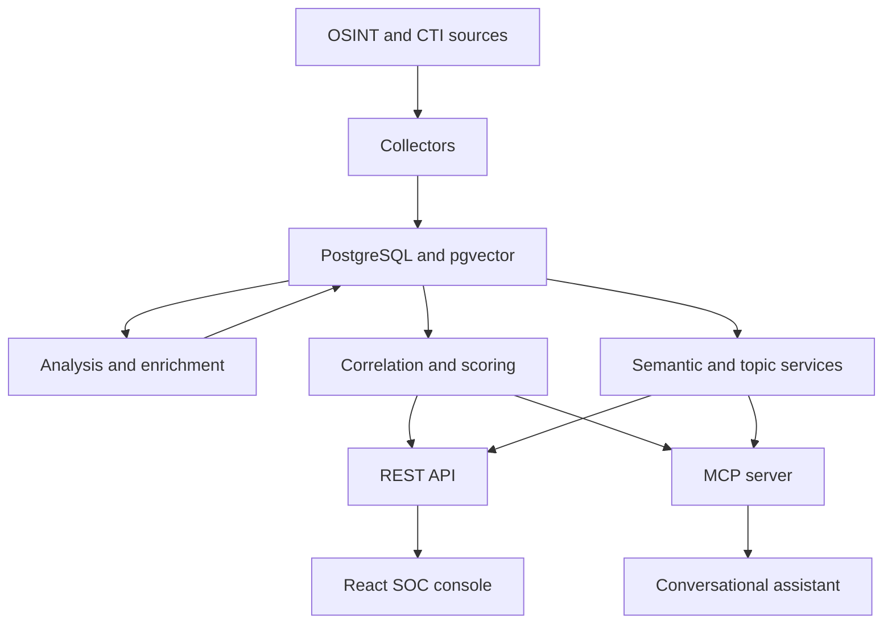

# ThreatIntelMCP

ThreatIntelMCP is a threat-intelligence platform developed in Python as a Final Year Project (PFE). It collects intelligence from OSINT and CTI sources, analyzes and enriches it, correlates indicators and vulnerabilities, calculates explainable threat scores, stores structured intelligence in PostgreSQL, and exposes the results through a REST API, a React frontend, and the Model Context Protocol (MCP).

The platform is designed for SOC investigation workflows. It combines deterministic internal services with external intelligence providers while preserving local evidence, confidence information, warnings, and operational state.

## Project status

**Status:** PFE delivery candidate; core implementation and final technical audits completed.

**Backend:** Operational.

**Frontend:** Operational.

**REST API:** 21 validated GET operations.

**MCP server:** 31 tools, including read-only investigation tools and confirmation-protected action tools.

**Automated validation:** 1,153 tests: 1,097 Python tests and 56 frontend tests.

The implemented pipeline is:

```text
RSS, GitHub and MITRE collection
-> PostgreSQL and pgvector storage
-> Claude article analysis
-> IOC normalization and CVE/OTX/VirusTotal enrichment
-> multi-source correlation
-> explainable threat and confidence scoring
-> semantic indexing and emerging-topic detection
-> REST API, web frontend and MCP server
-> SOC analyst or conversational assistant
```

### Implemented capabilities

- [x] RSS collection from The Hacker News, BleepingComputer and Cisco Talos
- [x] PostgreSQL storage through SQLAlchemy Core
- [x] Claude-based article analysis with validation and controlled fallback
- [x] IOC, CVE, malware, ATT&CK technique, APT group, sector and technology extraction
- [x] Strict IOC normalization and type validation
- [x] NVD CVE lookup, normalization, caching and stale-cache fallback
- [x] AlienVault OTX lookup, caching and stale-cache fallback
- [x] VirusTotal indicator lookup, normalization, 24-hour caching and stale-cache fallback
- [x] GitHub Security Advisory collection, package relationships and retrieval
- [x] MITRE ATT&CK synchronization for Enterprise, Mobile and ICS
- [x] Idempotent curated-report imports for MacSync and TWINLOOT intelligence
- [x] Article-to-IOC relationships and indicator correlation
- [x] CVE, MITRE and GitHub Advisory supporting-article evidence
- [x] Article and indicator investigations
- [x] Explainable threat, confidence and priority scoring
- [x] Structured warnings shared by REST and MCP
- [x] Semantic article search with pgvector
- [x] Automatic embedding creation and refresh
- [x] Emerging-threat topic detection with DBSCAN and TF-IDF
- [x] Relative-share trend detection for rising, stable and declining topics
- [x] Versioned REST API with 21 validated GET operations
- [x] React analyst frontend connected to the REST API
- [x] MCP read tools and confirmation-protected action tools
- [x] Claude Desktop integration over local MCP stdio
- [x] Pipeline status reporting and controlled automation cycles
- [x] RSS timeout and failure isolation
- [x] Semantic-worker timeout and zombie-process prevention
- [x] Rotating application and automation logs
- [x] Windows Task Scheduler automation with duplicate-run prevention
- [x] Deterministic unit, contract, regression and PostgreSQL integration tests
- [x] Isolated PostgreSQL integration database
- [x] Controlled live smoke tests separated from pytest
- [x] Dependency, configuration, Git-secret and backend-security audits
- [x] French technical documentation for completed modules

### Remaining PFE delivery work

- [x] Final report alignment checklist and PFE traceability matrix
- [x] Presentation slides and controlled demonstration script
- [ ] Final screenshots and delivery packaging

Production deployment, remote authentication and continuous synchronization are intentionally reserved for post-PFE development.

## Architecture



The architecture separates:

1. external collection;
2. durable storage and cache management;
3. AI analysis and deterministic validation;
4. enrichment, correlation and scoring;
5. semantic retrieval and topic detection;
6. REST, frontend and MCP delivery;
7. controlled automation, logging and operational status.

External services can be mocked while tests continue to exercise internal services and PostgreSQL repositories.

## Intelligence sources

| Source | Purpose | Status |
|---|---|---|
| The Hacker News | RSS cybersecurity articles | Operational |
| BleepingComputer | RSS cybersecurity articles | Operational |
| Cisco Talos | Threat research articles | Operational |
| NVD | CVE details and CVSS enrichment | Operational |
| GitHub Security Advisories | Package and vulnerability advisories | Operational |
| MITRE ATT&CK | Enterprise, Mobile and ICS techniques | Operational |
| AlienVault OTX | Indicator reputation and pulse intelligence | Operational |
| VirusTotal | Indicator analysis statistics and detection consensus | Operational |

## Core capabilities

### Collection and analysis

RSS articles are normalized and inserted idempotently using their links. Pending articles are analyzed by Claude with a strict JSON contract. The analyzer validates required fields, classifications, severity, confidence, CVE identifiers and MITRE technique identifiers before allowing the pipeline to continue.

An analysis failure leaves the article unprocessed. A later retry can succeed without duplicating the article or its dependent intelligence.

### Enrichment and caching

CVE intelligence is obtained from NVD and indicator intelligence from AlienVault OTX and VirusTotal. All integrations normalize external responses before storage and use local cache-freshness rules. VirusTotal lookups use the public report APIs for IP addresses, domains, URLs and file hashes; the project never uploads a file sample.

When a provider is unavailable, stale cached intelligence can remain available with explicit warnings. Automated tests mock unstable external boundaries and do not require live Internet services.

### Correlation and investigation

Normalized indicators are linked to their originating articles. Investigation services combine local article evidence with CVE, OTX, MITRE and GitHub Advisory intelligence.

Article investigations can aggregate:

- analysis, severity and confidence;
- CVEs and enrichment;
- normalized indicators and local sightings;
- OTX context;
- malware and ATT&CK context;
- warnings produced by unavailable optional enrichment.

The CVE, MITRE and GitHub Advisory modules can also return the locally stored articles that support a structured intelligence record.

### Scoring and prioritization

ThreatIntelMCP calculates separate threat and confidence assessments before producing a priority and recommended action. The scoring logic is transparent and deterministic.

Important outputs include:

- threat score and level;
- confidence score and level;
- priority code and label;
- recommended action;
- contributing factors;
- structured warnings with `source` and `message`.

REST and MCP expose consistent scoring values and warnings.

### Semantic search

Semantic Search V1 is implemented for threat articles using:

- `intfloat/multilingual-e5-small`;
- Sentence Transformers;
- 384-dimensional normalized embeddings;
- PostgreSQL with pgvector;
- cosine similarity;
- SHA-256 content hashes for change detection.

Article embeddings are created in advance. During a search, only the query is embedded before PostgreSQL compares it with stored vectors.

The indexed passage prioritizes content in this order:

```text
AI summary -> RSS summary -> title
```

Natural-language queries are supported in English and French. The embedding worker runs in an isolated subprocess so a timeout can terminate it without leaving a zombie process or corrupting MCP stdio communication.

### Emerging-threat topics

Emerging-topic detection identifies recurring semantic themes from stored article embeddings without calling an external provider.

The implementation uses:

- a configurable observation window, defaulting to 30 days;
- a recent comparison window, defaulting to 7 days;
- DBSCAN with cosine distance;
- a calibrated `eps` value and minimum cluster size;
- TF-IDF labels and keywords;
- relative recent and previous article shares;
- representative articles selected by centroid similarity;
- aggregated CVE, malware, MITRE, APT, sector and technology evidence.

Articles outside sufficiently dense groups remain noise instead of being presented as false trends. Topics are classified as `rising`, `stable` or `declining`.

## Analyst frontend

The React frontend provides a SOC-oriented interface for the REST API.

Available pages include:

- platform overview and pipeline status;
- analyzed article browsing;
- article investigation and scoring;
- semantic article search;
- indicator correlation, OTX context and scoring;
- emerging topics;
- CVE intelligence and supporting articles;
- MITRE ATT&CK search, details and local evidence;
- GitHub Security Advisory search, package details and local evidence;
- article-derived malware, APT group, targeted-sector and affected-technology search.

The frontend uses bookmarkable routes under `/intelligence` and communicates with FastAPI through the local Vite proxy.

## REST API

The FastAPI application exposes 21 validated GET operations. Most are read-only; an exact CVE lookup can retrieve and persist NVD intelligence when the record is not available locally.

| Domain | Endpoint | Purpose |
|---|---|---|
| Health | `GET /health` | API availability |
| Pipeline | `GET /api/v1/pipeline/status` | Operational pipeline state |
| Articles | `GET /api/v1/articles` | Search analyzed articles |
| Articles | `GET /api/v1/articles/{article_id}` | Article details |
| Articles | `GET /api/v1/articles/{article_id}/investigation` | Full investigation |
| Articles | `GET /api/v1/articles/{article_id}/score` | Article scoring |
| Search | `GET /api/v1/search/articles/semantic` | Semantic article search |
| Topics | `GET /api/v1/topics/emerging` | Emerging-threat topics |
| CVEs | `GET /api/v1/cves` | Search cached CVEs |
| CVEs | `GET /api/v1/cves/{cve_id}` | Retrieve or refresh CVE details |
| CVEs | `GET /api/v1/cves/{cve_id}/articles` | Supporting articles |
| Indicators | `GET /api/v1/indicators/correlation` | Indicator correlation |
| Indicators | `GET /api/v1/indicators/score` | Indicator scoring |
| MITRE | `GET /api/v1/mitre/techniques` | Search ATT&CK techniques |
| MITRE | `GET /api/v1/mitre/techniques/{technique_id}` | Technique details |
| MITRE | `GET /api/v1/mitre/techniques/{technique_id}/articles` | Supporting articles |
| GitHub | `GET /api/v1/github/advisories` | Search advisories |
| GitHub | `GET /api/v1/github/advisories/{ghsa_id}` | Advisory details |
| GitHub | `GET /api/v1/github/advisories/{ghsa_id}/articles` | Supporting articles |
| Entities | `GET /api/v1/entities` | Search normalized entity values |
| Entities | `GET /api/v1/entities/evidence` | Entity supporting articles |

Interactive OpenAPI documentation is available at `http://127.0.0.1:8000/docs` while the REST server is running.

## MCP server

The MCP server exposes 31 tools over local stdio.

### General and article intelligence

- `ping`
- `search_threat_articles`
- `semantic_search_threat_articles`
- `get_emerging_threat_topics`
- `get_threat_article_details`
- `investigate_threat_article`
- `score_threat_article`

### CVE, indicators and extracted entities

- `search_cves`
- `get_cve_details`
- `get_cve_supporting_articles`
- `lookup_otx_indicator`
- `lookup_virustotal_indicator`
- `correlate_threat_indicator`
- `score_threat_indicator`
- `search_malware`
- `search_mitre`
- `search_apt_groups`
- `search_targeted_sectors`
- `search_affected_technologies`

### GitHub and MITRE intelligence

- `search_github_advisories`
- `get_github_advisory_details`
- `get_github_advisory_supporting_articles`
- `search_mitre_techniques`
- `get_mitre_technique_details`
- `get_mitre_technique_supporting_articles`

### Pipeline status and controlled actions

- `get_pipeline_status`
- `ingest_rss_articles`
- `process_pending_articles`
- `index_pending_embeddings`
- `synchronize_mitre_intelligence`
- `synchronize_github_intelligence`

Mutating tools require an explicit `confirm=true`. Search and investigation tools remain read-only.

## Project structure

```text
ThreatIntelMCP/
|-- ai/                    # Claude analysis and validation
|-- api/                   # FastAPI application, routers and schemas
|-- collectors/            # RSS, GitHub, MITRE, OTX and VirusTotal collectors
|-- correlation/           # Article and indicator investigations
|-- database/              # SQLAlchemy Core repositories and schema
|   `-- migrations/        # Versioned database migrations
|-- docs/                  # French technical documentation
|-- enrichment/            # CVE, IOC, OTX and VirusTotal enrichment
|-- frontend/              # React and TypeScript SOC console
|-- mcp_server/            # MCP server and test client
|-- observability/         # Controlled rotating logging configuration
|-- pipeline/              # Ingestion, processing and automation services
|-- scoring/               # Threat, confidence and priority scoring
|-- scripts/               # Automation, import and maintenance commands
|-- semantic_search/       # Embedding and semantic-search services
|-- topic_modeling/        # Emerging-topic detection
|-- tests/                 # Unit, contract and integration tests
|-- .env.example           # Secret-free environment template
|-- main.py                # Automation-cycle CLI entry point
|-- requirements.txt
`-- README.md
```

## Technology stack

### Backend and intelligence

- Python 3.10
- PostgreSQL and pgvector
- SQLAlchemy Core
- FastAPI and Pydantic
- MCP Python SDK
- Anthropic Claude
- Sentence Transformers
- scikit-learn
- NVD API
- GitHub Security Advisories
- MITRE ATT&CK STIX data
- AlienVault OTX
- VirusTotal API v3
- pytest and pytest-cov

### Frontend

- React 19
- TypeScript
- Vite
- React Router
- Recharts
- Lucide React
- Vitest and Testing Library

## Installation

### 1. Clone the repository

```powershell
git clone https://github.com/feres2005/ThreatIntelMCP.git
Set-Location ThreatIntelMCP
```

### 2. Create and activate the Python environment

```powershell
python -m venv venv
.\venv\Scripts\Activate.ps1
python -m pip install -r requirements.txt
```

The first semantic operation may download the embedding model.

### 3. Install frontend dependencies

```powershell
npm.cmd --prefix frontend install
```

### 4. Configure PostgreSQL

Install PostgreSQL, enable pgvector, create a development database and apply the SQL migrations in `database/migrations` in numerical order, or restore the current schema from `database/schema.sql`.

The normal local database is:

```text
threat_intel_db
```

Integration tests must use the separate database:

```text
threat_intel_test_db
```

### 5. Configure environment variables

Copy the tracked template:

```powershell
Copy-Item .env.example .env
```

Configure the required values in `.env`:

```dotenv
DATABASE_URL=
ANTHROPIC_API_KEY=
OTX_API_KEY=
GITHUB_TOKEN=
```

`DATABASE_URL` is required for database-backed operations. The provider keys are required only for the corresponding live Claude, OTX or GitHub operations.

Never commit `.env` or real credentials.

## Running the platform

Use three VS Code PowerShell terminals.

### Terminal 1 - REST backend

```powershell
Set-Location "C:\path\to\ThreatIntelMCP"
.\venv\Scripts\Activate.ps1
python -m uvicorn api.app:app --host 127.0.0.1 --port 8000 --reload
```

Available locally at:

- API: `http://127.0.0.1:8000`
- Swagger UI: `http://127.0.0.1:8000/docs`
- ReDoc: `http://127.0.0.1:8000/redoc`

### Terminal 2 - frontend

```powershell
Set-Location "C:\path\to\ThreatIntelMCP"
npm.cmd --prefix frontend run dev
```

The frontend is normally available at `http://127.0.0.1:5173`.

### Terminal 3 - maintenance and tests

```powershell
Set-Location "C:\path\to\ThreatIntelMCP"
.\venv\Scripts\Activate.ps1
```

### Controlled automation cycle

```powershell
python -m main
```

Optional enrichment remains disabled unless explicitly selected by the automation command.

### MCP server

The MCP server runs over stdio:

```powershell
python -m mcp_server.server
```

When launched manually, stdio is reserved for MCP protocol traffic. Controlled logs are sent to stderr and to `automation_logs/threatintelmcp.log`.

### Claude Desktop configuration

On Windows, edit:

```text
%APPDATA%\Claude\claude_desktop_config.json
```

Example configuration:

```json
{
  "mcpServers": {
    "ThreatIntelMCP": {
      "command": "C:\\path\\to\\ThreatIntelMCP\\venv\\Scripts\\python.exe",
      "args": ["-m", "mcp_server.server"],
      "cwd": "C:\\path\\to\\ThreatIntelMCP",
      "env": {
        "PYTHONPATH": "C:\\path\\to\\ThreatIntelMCP"
      }
    }
  }
}
```

Restart Claude Desktop after saving the configuration. Start with the read-only `ping` and `get_pipeline_status` tools.

## Automation and observability

The automation cycle executes:

1. pipeline status before the cycle;
2. RSS ingestion;
3. pending article processing;
4. pending embedding indexing;
5. pipeline status after the cycle.

Failures are isolated per step and produce `completed_with_warnings` or `failed` rather than false success.

The Windows Task Scheduler configuration used during development prevents overlapping runs with `IgnoreNew` and applies a one-hour execution limit.

Logging is written to stderr and to:

```text
automation_logs/threatintelmcp.log
```

The file handler rotates at 2 MB and keeps three backups. Runtime logs are excluded from Git.

## Testing and validation

The final validated test inventory is:

| Suite | Result |
|---|---:|
| Python non-integration | 1,018 passed |
| PostgreSQL integration | 12 passed |
| Python baseline before VirusTotal | 1,030 tests |
| Frontend baseline before VirusTotal | 56 passed across 19 files |
| Final validation after VirusTotal | 1,153 tests: 1,097 Python and 56 frontend |
| Final post-VirusTotal total | Recollect before freezing the report |

No coverage threshold is currently configured. Test counts and behavior are reported directly without claiming an unconfigured coverage gate.

### Python non-integration suite

```powershell
python -m pytest -q -m "not integration"
```

### PostgreSQL integration suite

Integration tests are guarded by `RUN_POSTGRES_INTEGRATION` and verify the database boundary before cleanup.

```powershell
$env:RUN_POSTGRES_INTEGRATION = "1"

try {
  python -m pytest -q -m integration
}
finally {
  Remove-Item `
    Env:RUN_POSTGRES_INTEGRATION `
    -ErrorAction SilentlyContinue
}
```

### Frontend validation

```powershell
npm.cmd --prefix frontend run test
npm.cmd --prefix frontend run lint
npm.cmd --prefix frontend run build
```

The final validation produced:

- 19 frontend test files passed;
- 56 frontend tests passed;
- zero lint warnings and errors;
- successful TypeScript and Vite production build.

### Dependency audits

The final configuration audit produced:

- `pip check`: no broken requirements;
- `pip-audit`: no known Python vulnerabilities;
- `npm audit`: no frontend vulnerabilities.

`httpx` and `httpx2` are intentionally both pinned: normal application dependencies use `httpx`, while the current Starlette `TestClient` uses `httpx2`.

## Reliability and safety guarantees

Automated validation covers the following behaviors:

- mandatory failure never produces false success;
- optional enrichment failure produces warnings;
- analysis failure leaves an article retryable;
- successful processing updates state correctly;
- retries do not duplicate articles, IOCs, analyses or embeddings;
- stale enrichment can remain available during external outages;
- RSS feeds use explicit timeouts and controlled headers;
- semantic-worker timeout terminates and reaps the worker;
- SQLAlchemy validates pooled connections before reuse;
- PostgreSQL and MCP sessions recover from controlled failures;
- integration fixtures refuse to clean the development database;
- REST and MCP preserve important scoring and topic values;
- MCP mutation tools require explicit confirmation;
- unexpected REST errors produce controlled public responses.

## Security model

The validated PFE deployment is local-only:

- the documented Uvicorn command binds FastAPI to `127.0.0.1`;
- Vite proxies to the local API;
- MCP uses local stdio;
- no permissive CORS policy is configured;
- `.env` and runtime logs are excluded from Git;
- `.env.example` contains no values;
- SQL uses parameterized SQLAlchemy Core statements;
- REST schemas and MCP tools validate public inputs;
- external responses are normalized before storage;
- secrets are passed through environment variables and provider headers;
- internal exceptions are converted to controlled public responses.

Authentication and authorization are not implemented because the current system is not exposed as a remote multi-user service. A public deployment would require TLS, authentication, authorization, rate limiting, explicit CORS and trusted-host configuration.

The semantic worker currently inherits the parent environment. Restricting it to the minimum required variables is recorded as `TODO(POST-PFE-006)` and documented as a post-PFE hardening task.

## Documentation

French technical documentation is maintained in `docs/`. Recent finalization documents include:

- `19_interface_web.md` - frontend interface;
- `20_fiabilite_observabilite.md` - reliability and observability;
- `21_audit_mcp_agent_conversationnel.md` - MCP and conversational-agent audit;
- `22_validation_finale_end_to_end.md` - final end-to-end validation;
- `23_audit_configuration_securite.md` - configuration and security audit;
- `24_matrice_tracabilite_exigences_pfe.md` - PFE requirement traceability;
- `25_guide_demonstration_finale.md` - controlled final demonstration;
- `26_liste_captures_finales.md` - final screenshot checklist;
- `27_integration_virustotal.md` - VirusTotal integration;
- `28_alignement_rapport_final_pfe.md` - final report alignment;
- `29_snapshot_demonstration_stable.md` - stable demonstration snapshot;
- `30_release_finale_pfe.md` - final release procedure.

The defense deck is available in
`presentation/ThreatIntelMCP_Soutenance_PFE.pptx`.

FastAPI also generates interactive OpenAPI documentation from the implemented routes and Pydantic schemas.

## Current limitations

- Semantic Search V1 indexes articles only.
- Topic results are calculated on demand and are not stored as historical snapshots.
- Live collection and enrichment depend on external provider availability and quotas.
- The current REST API and MCP server are designed for local execution.
- Remote authentication, authorization, TLS and rate limiting are not implemented.
- The semantic worker still inherits unrelated provider credentials from the parent environment.
- Full article-webpage scraping is outside the agreed PFE scope.
- Scheduled OTX and NVD enrichment are intentionally disabled by default.
- Scheduled MITRE and incremental GitHub synchronization are planned as post-PFE extensions.

## Roadmap

### PFE delivery

- [x] align the written report with the implemented architecture;
- [x] prepare demonstration scenarios for REST, frontend and MCP;
- [ ] capture the final screenshots on the frozen local demonstration system;
- [x] prepare the presentation and delivery procedures;
- [ ] execute the database backup and create the final Git tag after the
  screenshots and report are frozen.

### Post-PFE development

- authenticated remote deployment with TLS and rate limiting;
- least-privilege subprocess environments;
- scheduled MITRE ATT&CK synchronization;
- scheduled incremental GitHub Advisory synchronization;
- historical topic snapshots and alerting;
- optional CISA KEV, URLhaus and MISP integrations;
- hybrid semantic and keyword retrieval;
- continuous monitoring and deployment automation.

## Development methodology

Each module follows the same process:

1. understand the theory and PFE requirement;
2. design responsibilities and boundaries;
3. implement incrementally;
4. test deterministic behavior and failures;
5. run integration validation where necessary;
6. refactor and review;
7. document the module in French;
8. validate the complete suite;
9. commit and push the milestone.

## License

No license has currently been specified for this project.
