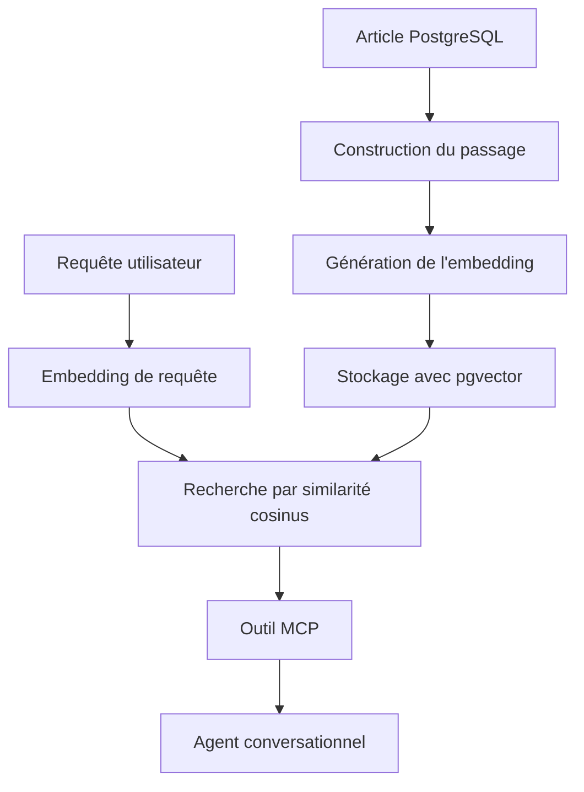
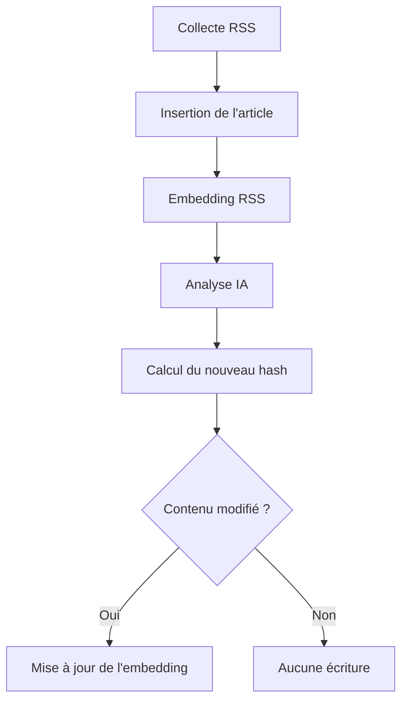

# Recherche sémantique des articles de Threat Intelligence

## 1. Présentation du module

Le module de recherche sémantique permet d’interroger les articles de Threat Intelligence à partir du sens d’une requête en langage naturel, sans dépendre uniquement de la présence exacte de mots-clés.

Une recherche classique par mots-clés utilise principalement des correspondances textuelles. Elle peut donc ignorer un article pertinent lorsque la requête et l’article emploient des formulations différentes. Par exemple, une requête concernant des « attaques menées par un acteur situé à proximité contre des fonctionnalités de partage sans fil » doit pouvoir retrouver un article portant sur des vulnérabilités dans AirDrop et Quick Share, même si les mêmes mots ne sont pas tous présents dans le titre.

Pour résoudre cette limite, le système transforme les requêtes et les articles en vecteurs numériques appelés *embeddings*. Ces vecteurs représentent leur contenu sémantique. PostgreSQL, avec l’extension pgvector, compare ensuite ces représentations afin de classer les articles selon leur similarité avec la requête.

## 2. Objectifs

Le module poursuit les objectifs suivants :

- permettre une recherche en langage naturel ;
- prendre en charge les requêtes en français et en anglais ;
- classer les résultats selon leur pertinence sémantique ;
- éviter la génération d’un embedding pendant chaque recherche ;
- mettre à jour un embedding uniquement lorsque le contenu de l’article change ;
- exposer la fonctionnalité comme outil MCP ;
- permettre à l’agent conversationnel de sélectionner automatiquement la recherche sémantique lorsqu’elle correspond au besoin de l’utilisateur ;
- préparer une architecture extensible à d’autres entités de Threat Intelligence.

## 3. Architecture du module

La recherche sémantique est organisée en plusieurs composants afin de séparer la préparation du contenu, la génération des embeddings, leur stockage et l’exposition de la fonctionnalité par MCP.



Les principales responsabilités sont réparties comme suit :

- `semantic_search/article_content.py` prépare le texte indexable et calcule son empreinte SHA-256 ;
- `semantic_search/embedding_service.py` charge le modèle et génère les vecteurs ;
- `database/embedding_repository.py` assure la persistance et la recherche avec pgvector ;
- `semantic_search/article_embedding_service.py` orchestre l’indexation des articles ;
- `semantic_search/search_service.py` valide les requêtes et exécute la recherche ;
- `scripts/backfill_article_embeddings.py` indexe les articles historiques ;
- `mcp_server/server.py` expose la recherche à l’agent conversationnel ;
- `main.py` maintient les embeddings pendant l’ingestion.

Cette séparation limite le couplage entre le serveur MCP, le modèle d’embedding et PostgreSQL. Elle facilite également les tests et les évolutions futures.

## 4. Choix technologiques

### 4.1 Modèle d’embedding

Le modèle retenu est :

```text
intfloat/multilingual-e5-small
```

Il est exécuté localement avec la bibliothèque Sentence Transformers. Il produit des vecteurs de 384 dimensions et prend en charge plusieurs langues, notamment le français et l’anglais.

Ce choix répond aux besoins du projet pour plusieurs raisons :

- compatibilité avec des requêtes multilingues ;
- exécution locale sans appel payant pour chaque recherche ;
- dimensions suffisamment réduites pour limiter le stockage ;
- qualité adaptée à la recherche sémantique ;
- intégration directe avec Sentence Transformers.

Le modèle est chargé une seule fois par processus grâce à un cache en mémoire. Les appels suivants réutilisent la même instance, ce qui évite de recharger les poids du modèle.

### 4.2 Extension pgvector

L’extension pgvector permet à PostgreSQL de stocker et de comparer directement les embeddings.

La recherche utilise la distance cosinus fournie par l’opérateur :

```sql
<=>
```

La distance est convertie en score de similarité avec la formule suivante :

```text
similarité = 1 - distance cosinus
```

Un score élevé indique une plus grande proximité sémantique. Ce score représente une mesure de classement et non une probabilité.

La recherche exacte a été conservée pour la première version. Avec environ 500 articles, elle reste simple et suffisamment performante. Un index approximatif HNSW ou IVFFlat pourra être évalué lorsque le volume de données deviendra beaucoup plus important.

### 4.3 Périmètre initial

La première version applique la recherche sémantique uniquement aux articles de Threat Intelligence.

Les indicateurs OTX conservent une recherche exacte, car une adresse IP, un domaine ou un hash doit être identifié précisément. La table d’embeddings reste néanmoins générique afin de permettre une extension future aux CVE, aux avis GitHub et aux techniques MITRE ATT&CK.


## 5. Conception de la base de données

La migration `003_create_intelligence_embeddings.sql` active pgvector et crée la table générique `intelligence_embeddings`.

| Colonne           | Type          | Rôle                                          |
|---                |---            |---                                            |
| `entity_type`     | `TEXT`        | Type d’entité indexée, par exemple `article`  |
| `entity_id`       | `TEXT`        | Identifiant de l’entité                       |
| `embedding`       | `vector(384)` | Représentation vectorielle du contenu         |
| `embedding_model` | `TEXT`        | Modèle utilisé pour générer le vecteur        |
| `content_hash`    | `TEXT`        | Empreinte SHA-256 du passage indexé           |
| `embedded_at`     | `TIMESTAMPTZ` | Date de création ou de mise à jour            |

La clé primaire composite est constituée de :

```sql
PRIMARY KEY (entity_type, entity_id)
```

Elle garantit qu’une entité ne possède qu’un seul embedding actif.

L’identifiant est stocké sous forme de texte afin de prendre en charge différents formats : identifiant numérique d’article, identifiant CVE ou identifiant GHSA. Aucune clé ét rangère directe vers `articles` n’est utilisée, car la table est destinée à plusieurs types d’entités.

La requête d’insertion utilise un mécanisme d’UPSERT. Un embedding existant est mis à jour uniquement lorsque son contenu ou son modèle a changé.

## 6. Préparation du contenu des articles

### 6.1 Normalisation du texte

Avant l’indexation, les espaces répétés, tabulations et retours à la ligne sont normalisés. Cette opération produit un texte stable et évite de recalculer un embedding pour une simple différence de mise en forme.

### 6.2 Construction du passage

Le passage indexé respecte la structure suivante :

```text
Title: titre de l’article
Summary: résumé sélectionné
```

Le résumé généré par l’analyse IA est utilisé en priorité. Lorsqu’il n’existe pas encore, le résumé RSS est utilisé. Si aucun résumé n’est disponible, le titre seul reste indexable.

L’ordre de sélection est donc :

```text
résumé IA → résumé RSS → titre uniquement
```

Les résumés IA et RSS ne sont pas concaténés, car ils contiennent fréquemment des informations identiques. Leur combinaison augmenterait inutilement le texte et donnerait davantage de poids aux informations répétées.

### 6.3 Détection des changements

Une empreinte SHA-256 est calculée à partir du passage final :

```text
passage → SHA-256 → content_hash
```

Avant de générer un nouvel embedding, le service compare cette empreinte et le nom du modèle avec les valeurs stockées.

- même contenu et même modèle : statut `unchanged` ;
- nouvel article : statut `created` ;
- contenu ou modèle modifié : statut `updated` ;
- article inexistant : statut `not_found`.

Cette stratégie évite les calculs et les écritures inutiles en base de données.


## 7. Processus d’indexation

### 7.1 Indexation initiale

Le script suivant permet d’indexer les articles historiques qui ne possèdent pas encore d’embedding :

```powershell
python -m scripts.backfill_article_embeddings
```

Les articles sont traités par lots de 25. Cette valeur limite la quantité de travail effectuée par requête, mais ne limite pas le nombre total d’articles : le traitement continue jusqu’à ce qu’aucun article sans embedding ne soit trouvé.

### 7.2 Intégration au pipeline

L’indexation est également intégrée au pipeline principal.

Après la collecte RSS, les nouveaux articles reçoivent un premier embedding construit à partir de leur titre et de leur résumé RSS.

Après l’analyse IA, l’article traité est indexé une nouvelle fois. Le résumé IA devient alors prioritaire. Si le passage a changé, l’ancien embedding est remplacé.



Cette intégration garantit que les recherches utilisent progressivement la meilleure information disponible.

### 7.3 Préfixes du modèle E5

Le modèle E5 distingue les requêtes des contenus indexés grâce à des préfixes :

```text
query: requête de l’utilisateur
passage: contenu de l’article
```

Le respect de cette convention est nécessaire pour obtenir des comparaisons cohérentes avec ce modèle.

Les vecteurs sont également normalisés lors de leur génération afin de rendre la comparaison par similarité cosinus stable.

## 8. Exécution d’une recherche sémantique

La fonction publique `semantic_search_articles` reçoit une requête et une limite de résultats.

Elle effectue les étapes suivantes :

1. validation de la requête ;
2. validation de la limite ;
3. génération de l’embedding avec le préfixe `query:` ;
4. recherche des embeddings créés avec le même modèle ;
5. classement par distance cosinus croissante ;
6. conversion de la distance en score de similarité ;
7. retour des métadonnées des articles.

Une requête vide est refusée. La limite doit être comprise entre 1 et 50 afin d’éviter des réponses excessivement volumineuses.

Chaque résultat contient notamment :

- l’identifiant de l’article ;
- le titre ;
- le lien ;
- la source ;
- la date de publication ;
- le résumé disponible ;
- le score de similarité.

Le score permet de classer les résultats, mais ne constitue pas une probabilité de pertinence. Aucun seuil minimal arbitraire n’a été imposé dans la première version.

## 9. Intégration MCP

La fonctionnalité est exposée par l’outil MCP :

```text
semantic_search_threat_articles
```

Il accepte :

- `search_query` : question ou description en langage naturel ;
- `limit` : nombre de résultats souhaité, avec une valeur par défaut de 10.

L’outil `search_threat_articles` reste disponible pour les recherches exactes par mots-clés. Les descriptions des deux outils permettent à l’agent conversationnel de choisir celui qui correspond le mieux à l’intention de l’utilisateur.

L’utilisateur n’est donc pas obligé de mentionner le nom de l’outil. Il peut formuler directement une demande en français ou en anglais. L’agent analyse la demande, sélectionne la recherche appropriée et utilise les résultats retournés par le serveur MCP.

## 10. Validation et tests

Le module a été validé progressivement à chaque niveau de l’architecture.

### 10.1 Génération des embeddings

Les tests ont confirmé que :

- le modèle est chargé correctement ;
- le résultat est une liste Python ;
- chaque embedding contient exactement 384 dimensions ;
- les requêtes vides sont rejetées ;
- les types de texte autres que `query` et `passage` sont rejetés ;
- les vecteurs contiennent uniquement des nombres finis.

### 10.2 Détection des changements

Les tests du mécanisme de hash ont confirmé que :

- un contenu identique produit le même hash ;
- une modification du contenu produit un hash différent ;
- une première indexation retourne `created` ;
- une nouvelle indexation sans modification retourne `unchanged` ;
- une modification du passage retourne `updated`.

### 10.3 Intégrité de la base

Après le backfill, les résultats suivants ont été vérifiés dans PostgreSQL :

```text
Nombre total d’articles : 498
Articles avec embedding : 498
Articles sans embedding : 0
```

Les embeddings stockés possèdent tous :

- 384 dimensions ;
- le modèle `intfloat/multilingual-e5-small` ;
- une empreinte SHA-256 de 64 caractères.

### 10.4 Qualité de la recherche

Une requête en anglais concernant des vulnérabilités dans les fonctionnalités de partage de fichiers sans fil a classé l’article sur AirDrop et Quick Share en première position.

Une requête équivalente en français a produit un classement similaire. Ce résultat confirme la capacité multilingue du modèle et la recherche par sens plutôt que par correspondance exacte.

### 10.5 Validation des entrées publiques

Les tests ont confirmé le rejet :

- d’une requête vide ;
- d’une limite égale à zéro ;
- d’une limite supérieure à 50 ;
- de valeurs de limite invalides.

### 10.6 Validation MCP

Le client MCP local a confirmé :

- la présence de `semantic_search_threat_articles` dans la liste des outils ;
- l’exécution correcte de la recherche par le protocole MCP ;
- la sérialisation correcte des résultats ;
- le classement de l’article AirDrop et Quick Share en première position.

Un test final avec Claude Desktop a également confirmé que l’agent peut sélectionner automatiquement les outils de recherche appropriés à partir d’une question naturelle en français, sans que l’utilisateur indique explicitement le nom de l’outil.

## 11. Limites et améliorations futures

La première version possède les limites suivantes :

- seuls les articles sont indexés ;
- la recherche utilise une comparaison exacte de tous les vecteurs ;
- le premier appel doit charger le modèle local en mémoire ;
- aucun seuil minimal de similarité n’est imposé ;
- le script de backfill traite uniquement les embeddings manquants ;
- aucun outil global de réindexation n’est encore disponible lors d’un changement de modèle.

Ces limites ne bloquent pas le fonctionnement actuel. Elles définissent les évolutions possibles :

- ajouter la recherche sémantique pour les CVE, GHSA et techniques MITRE ATT&CK ;
- évaluer un index HNSW lorsque le volume de données augmente ;
- ajouter une commande de réindexation complète lors d’une migration de modèle ;
- mesurer la qualité des résultats sur un jeu de requêtes représentatif ;
- déterminer expérimentalement si un seuil de similarité est nécessaire ;
- combiner recherche sémantique, mots-clés et filtres structurés dans une recherche hybride.

## 12. Conclusion

Le module apporte au serveur MCP une capacité de recherche fondée sur le sens des requêtes. Les articles sont préparés, transformés en embeddings, stockés dans PostgreSQL avec pgvector et maintenus automatiquement pendant le pipeline d’ingestion.

L’utilisation d’un modèle multilingue permet aux analystes d’interroger la plateforme en français ou en anglais. Le mécanisme de hash évite les calculs inutiles, tandis que l’intégration MCP permet à l’agent conversationnel d’utiliser cette intelligence sans exposer la complexité technique à l’utilisateur.

Cette réalisation répond à l’objectif de recherche sémantique défini dans le cahier des charges du PFE et constitue une base extensible pour les futures capacités avancées de la plateforme.

## Compatibilité avec MCP stdio sous Windows

Sous Windows, le chargement de Sentence Transformers, NumPy et SciPy dans le processus principal du serveur MCP peut provoquer un blocage du transport `stdio`. Ces bibliothèques chargent plusieurs composants natifs pendant que le serveur MCP utilise déjà des threads et des flux asynchrones pour communiquer avec le client.

Le chargement complet du modèle avant le démarrage du serveur n'est pas une solution suffisante. Il retarde la réponse à la requête d'initialisation et peut dépasser le délai maximal de 60 secondes appliqué par Claude Desktop.

Afin de séparer le traitement scientifique du transport MCP, la recherche sémantique est exécutée dans un processus Python isolé.

Le module `semantic_search/search_worker.py` reçoit la requête et la limite, charge le modèle d'embedding, effectue la recherche vectorielle et sérialise le résultat au format JSON.

Le module `semantic_search/subprocess_service.py` est responsable du lancement et de la supervision de ce processus. Il capture ses sorties, impose un délai maximal d'exécution et convertit le résultat JSON en objets Python avant de le transmettre au serveur MCP.

Le flux d'exécution est le suivant :

```text
Claude Desktop
      |
      v
Serveur MCP
      |
      v
subprocess_service.py
      |
      v
Processus Python isolé
      |
      v
Sentence Transformers et recherche pgvector
      |
      v
Résultat JSON capturé
      |
      v
Serveur MCP
      |
      v
Claude Desktop