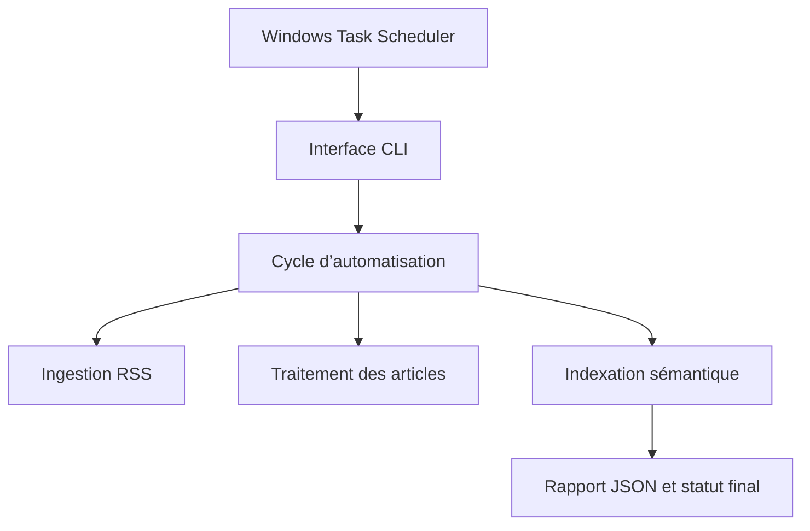

# 14. AUTOMATISATION DU PIPELINE

## 14.1 Objectif

Le module d’automatisation permet d’exécuter périodiquement les principales opérations de la plateforme ThreatIntelMCP sans intervention manuelle constante.

Il coordonne la collecte des articles RSS, l’analyse d’un nombre limité d’articles en attente, la mise à jour des embeddings sémantiques ainsi que la supervision de l’état général du pipeline.

L’objectif n’est pas d’exécuter la totalité du traitement en une seule fois. Chaque cycle utilise des limites explicites afin de contrôler la charge appliquée à l’ordinateur, à la base PostgreSQL, au modèle d’intelligence artificielle et aux services externes.

L’automatisation repose sur les mêmes services métier que ceux utilisés par le serveur MCP. Cette approche évite la duplication de logique et garantit que les traitements manuels, conversationnels et planifiés suivent les mêmes règles.

## 14.2 Architecture

L’architecture sépare les opérations individuelles, leur orchestration et leur déclenchement.

| Composant | Responsabilité |
| --- | --- |
| `pipeline/ingestion_service.py` | Collecter les articles RSS et produire un rapport d’ingestion structuré. |
| `pipeline/automation_service.py` | Exécuter les opérations contrôlées de traitement, d’indexation, de synchronisation et de supervision. |
| `pipeline/automation_cycle_service.py` | Coordonner un cycle complet d’automatisation. |
| `database/pipeline_status_repository.py` | Calculer les compteurs globaux du pipeline avec une requête en lecture seule. |
| `scripts/run_automation_cycle.py` | Fournir une interface en ligne de commande utilisable par Windows Task Scheduler. |
| `main.py` | Rediriger l’ancien point d’entrée vers la nouvelle interface d’automatisation. |
| `mcp_server/server.py` | Exposer les opérations d’automatisation à Claude Desktop avec confirmation explicite. |



## 14.3 Ingestion RSS structurée

La fonction `ingest_rss_articles()` collecte les articles publiés par les sources RSS configurées dans la plateforme.

Pour chaque article, la base PostgreSQL indique si l’enregistrement a été nouvellement inséré ou s’il existait déjà. Cette distinction est rendue possible par la clause SQL `RETURNING` utilisée par `insert_article()`.

Le rapport d’ingestion contient notamment :

- le nombre d’articles collectés ;
- le nombre d’articles nouvellement insérés ;
- le nombre d’articles existants ou mis à jour ;
- le nombre d’échecs ;
- les identifiants des articles concernés ;
- les erreurs isolées ;
- le nombre total d’articles dans la base.

Une erreur affectant un article individuel ne provoque pas l’arrêt de l’ensemble de l’ingestion.

## 14.4 Traitement contrôlé des articles

La fonction `process_pending_articles()` sélectionne les articles non traités les plus anciens et délègue leur traitement au service de batch existant.

La taille d’un batch doit respecter les contraintes suivantes :

| Paramètre | Valeur |
| --- | --- |
| Valeur par défaut | 5 articles |
| Valeur minimale | 1 article |
| Valeur maximale | 20 articles |
| Réanalyse automatique | Interdite |
| Enrichissement OTX par défaut | Désactivé |
| Enrichissement CVE par défaut | Désactivé |

La réanalyse automatique n’est pas exposée afin d’éviter l’écrasement accidentel d’analyses déjà validées.

Les enrichissements OTX et CVE restent disponibles, mais ils sont désactivés dans le cycle fréquent afin de limiter les appels externes, le temps d’exécution et les erreurs liées aux API.

## 14.5 Cohérence des embeddings

Après l’enregistrement d’une nouvelle analyse, le passage utilisé pour la recherche sémantique change, car il contient désormais le résumé généré par l’intelligence artificielle.

La présence d’une ligne dans la table `intelligence_embeddings` ne garantit donc pas que l’embedding corresponde au contenu actuel.

Le pipeline appelle maintenant `index_article()` après chaque analyse réussie. Cette fonction recalcule le hash du contenu et compare celui-ci au hash enregistré.

Selon le résultat, l’embedding reçoit l’un des statuts suivants :

| Statut | Signification |
| --- | --- |
| `created` | Aucun embedding n’existait pour l’article. |
| `updated` | Le contenu a changé et l’embedding a été recalculé. |
| `unchanged` | Le contenu et le modèle sont identiques. |
| `failed` | La génération ou l’enregistrement a échoué. |
| `not_found` | L’article n’a pas pu être retrouvé lors de la mise à jour ; un avertissement est produit. |

Un échec d’embedding produit un avertissement, mais ne supprime pas une analyse valide et n’empêche pas l’article d’être marqué comme traité.

Cette stratégie maintient la cohérence entre l’analyse enregistrée et la recherche sémantique.

## 14.6 Cycle complet d’automatisation

La fonction `run_automation_cycle()` exécute les étapes suivantes :

1. récupération du statut initial du pipeline ;
2. ingestion des flux RSS ;
3. traitement d’un batch limité d’articles en attente ;
4. création des embeddings encore absents ;
5. récupération du statut final ;
6. construction d’un rapport structuré.

Chaque étape est isolée par une gestion d’exception. Une panne RSS n’empêche donc pas automatiquement le traitement des articles déjà présents dans la base.

Le statut final peut prendre trois valeurs :

| Statut | Signification |
| --- | --- |
| `completed` | Toutes les étapes se sont terminées sans erreur. |
| `completed_with_warnings` | Le cycle a continué malgré un ou plusieurs problèmes isolés. |
| `failed` | Toutes les étapes principales ont échoué. |

## 14.7 Interface en ligne de commande

Le script `scripts/run_automation_cycle.py` fournit les options suivantes :

| Option | Description |
| --- | --- |
| `--processing-limit` | Nombre maximal d’articles à analyser. |
| `--embedding-limit` | Nombre maximal d’embeddings manquants à créer. |
| `--include-otx` | Active explicitement l’enrichissement OTX. |
| `--include-cve` | Active explicitement l’enrichissement CVE. |
| `--output` | Enregistre le rapport JSON dans le fichier indiqué. |

Le rapport est écrit dans un fichier temporaire avant de remplacer le rapport précédent. Cette écriture réduit le risque d’obtenir un fichier partiellement écrit en cas d’interruption.

Les codes de sortie sont les suivants :

| Code | Signification |
| --- | --- |
| `0` | Cycle terminé avec succès. |
| `1` | Échec du cycle. |
| `2` | Cycle terminé avec avertissements. |

Le fichier `main.py` délègue désormais son exécution à cette interface. Il n’existe donc plus deux implémentations concurrentes du pipeline.

## 14.8 Supervision du pipeline

La fonction `get_pipeline_status()` fournit une vue synthétique de l’état de la plateforme.

Elle calcule notamment :

- le nombre total d’articles ;
- le nombre d’articles traités et en attente ;
- le nombre d’analyses disponibles ;
- le nombre d’articles traités sans analyse ;
- le nombre d’embeddings présents et manquants ;
- le nombre d’IOC typés ;
- le nombre de CVE enrichies ;
- le nombre d’indicateurs OTX ;
- le nombre de techniques MITRE ;
- le nombre d’advisories GitHub.

Les pourcentages de couverture sont calculés pour le traitement, l’analyse et l’indexation sémantique.

Le statut `attention_required` est utilisé lorsqu’une incohérence de données est détectée, par exemple lorsqu’un article est marqué comme traité sans posséder d’analyse.

## 14.9 Outils MCP d’automatisation

Les opérations Day 5 sont également exposées à Claude Desktop.

| Outil MCP | Type |
| --- | --- |
| `get_pipeline_status` | Lecture seule |
| `ingest_rss_articles` | Modification |
| `process_pending_articles` | Modification |
| `index_pending_embeddings` | Modification |
| `synchronize_mitre_intelligence` | Modification |
| `synchronize_github_intelligence` | Modification |

Toutes les opérations de modification exigent le paramètre `confirm=true`.

Avec `confirm=false`, l’outil retourne :

```json
{
  "status": "confirmation_required",
  "message": "Explicit confirmation is required before this operation can run."
}
```

Cette protection empêche Claude Desktop de lancer accidentellement une ingestion, une analyse ou une synchronisation externe.

## 14.10 Planification Windows

Le cycle principal est exécuté par Windows Task Scheduler avec la configuration suivante :

| Paramètre | Configuration |
| --- | --- |
| Nom | `ThreatIntelMCP Article Automation` |
| Fréquence | Toutes les deux heures |
| Limite de traitement | 5 articles |
| Limite d’embeddings | 25 articles |
| OTX automatique | Désactivé |
| CVE automatique | Désactivé |
| Exécution simultanée | Interdite |
| Durée maximale | Une heure |
| Alimentation | Secteur recommandé |

La commande exécutée est :

```text
python.exe -m scripts.run_automation_cycle --processing-limit 5 --embedding-limit 25 --output automation_logs/latest_cycle.json
```

Le répertoire de travail correspond à la racine du projet.

Les rapports contenus dans `automation_logs/` sont exclus de Git, car ils représentent des données d’exécution locales régulièrement remplacées.

Les synchronisations GitHub et MITRE restent séparées du cycle fréquent. Elles peuvent être déclenchées par MCP ou ajoutées ultérieurement à des tâches quotidiennes et hebdomadaires distinctes.

## 14.11 Validation fonctionnelle

Les principaux tests réalisés sont les suivants :

| Test | Résultat |
| --- | --- |
| Ingestion RSS réelle | 80 articles collectés, sans échec |
| Insertion avec détection des doublons | Succès |
| Isolation d’une erreur d’ingestion | Succès |
| Traitement contrôlé d’un article | Succès |
| Validation des limites de batch | Succès |
| Indexation de 52 embeddings manquants | 52 succès, 0 échec |
| Couverture d’embedding | 100 % |
| Synchronisation MITRE | 1 140 techniques |
| Synchronisation GitHub incrémentale | 1 446 advisories traitées sans échec |
| Confirmation des outils MCP | Succès |
| Protocole MCP réel | 26 outils disponibles |
| Cycle d’automatisation réel | Succès |
| Exécution Windows Task Scheduler | 5 articles traités, 0 échec |
| Mise à jour des embeddings analysés | 5 statuts `updated` |
| Rapport JSON planifié | Créé avec succès |

## 14.12 État final observé

Après les tests d’automatisation, l’état de la plateforme était le suivant :

| Mesure | Valeur |
| --- | ---: |
| Articles totaux | 620 |
| Articles traités | 177 |
| Articles analysés | 158 |
| Articles en attente | 443 |
| Articles traités sans analyse | 19 |
| Embeddings présents | 620 |
| Embeddings manquants | 0 |
| Couverture du traitement | 28,55 % |
| Couverture de l’analyse | 25,48 % |
| Couverture des embeddings | 100 % |
| Techniques MITRE | 1 140 |
| Advisories GitHub | 34 640 |

Le statut global reste `attention_required` uniquement en raison de 19 anciens articles marqués comme traités sans analyse. Les nouveaux cycles n’ont pas reproduit cette incohérence.

## 14.13 Limites et améliorations futures

Les améliorations suivantes pourront être ajoutées :

- correction contrôlée des 19 anciens articles sans analyse ;
- historique rotatif des rapports d’automatisation ;
- notification lorsqu’un cycle retourne des avertissements ;
- planification quotidienne de GitHub ;
- planification hebdomadaire de MITRE ATT&CK ;
- suivi des embeddings obsolètes dans le statut global ;
- augmentation progressive de la couverture d’analyse ;
- activation sélective des enrichissements externes.

## 14.14 Conclusion

Le module d’automatisation transforme le pipeline ThreatIntelMCP en un système capable de fonctionner périodiquement avec des limites de sécurité, une isolation des erreurs et une supervision structurée.

La même logique métier est désormais utilisée par la ligne de commande, Windows Task Scheduler, le serveur MCP et l’ancien point d’entrée `main.py`.

Cette organisation améliore la maintenabilité, la cohérence des données et la capacité de démonstration de la plateforme dans un contexte SOC.
